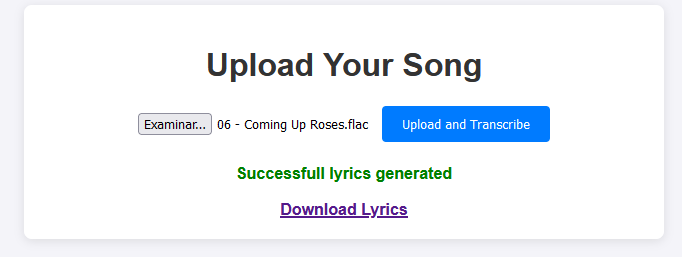

# Lyrics Generator Website

This is a website where you upload your favorite songs (in .flac format), the AI (whisper) process the lyrics and interprets it, and when it is done, you get a link to download the lyrics in .txt format

## KEEP IN MIND
- At the core of this project, we are building a lyrics generator using a free AI technology called Whisper, for transcription. While the system is designed to extract lyrics from songs and transcribe them into text, it is important to note a few key considerations:

    1. The generated lyrics are based on automatic speech recognition (ASR). This means the accuracy of the transcription will depend on the quality of the audio, background noise, and the clarity of the vocals in the song.

    2. As a result, the transcriptions may not always be perfect, especially for songs with heavy effects, overlapping vocals, or poor-quality recordings.

    3. While the initial version of the system may produce imperfect results, the AI model used is improving over time. As this model is fine-tuned or updated, the quality of the transcriptions is expected to improve, making the system more accurate and reliable.

    4. Additionally, feedback from users and continuous testing will help identify areas for improvement in the transcription processes :D

## Features
- Converts FLAC files to WAV format.
- Ensures audio files are in a suitable format for downstream tasks like vocal separation and transcription.
- Leverages Whisper for speech-to-text transcription.
- Handles different languages and accents (depending on the Whisper model).
- Outputs transcribed lyrics in a text or JSON format.
- Saves lyrics in a text file (generated_lyrics.txt) for download.

## Technologies Used
- **Backend**: 
  - **Flask**: Lightweight framework for creating and managing the web application.
  - **Whisper (OpenAI)**: Pretrained speech-to-text model for transcription.
  - **Pydub**: Handles audio format conversions and manipulations.
  - **OS Module**: Manages file system operations such as file paths and directories.
  - **JSON**: Formats transcription outputs and facilitates API responses.
- **Frontend**:
  - **HTML**
  - **JavaScript**
  - **Bootstrap for styling**

### Steps to Run

1. **Clone the repository**:
   ```bash
   git clone https://github.com/tarikii/LyricsGeneratorSongs
   cd LyricsGeneratorSongs
   ```
   
2. **Open the application and hit play**:
   Once the application is running, open the browsers and navigate to http://127.0.0.1:5000/. This will get you this UI:

   

3. **Start generating:**
   - Enter your favorite song (remember it has to be in FLAC format)
   - Press "**Upload and Transcribe**"
   - A message "processing..." will appear while you wait for the lyrics

   

   If everything went okay, you will have the URL for the lyrics to download in .txt

### Architecture

**Backend (Flask Application):**:
- **File Upload Endpoint (/upload)**:
    1. Receives the uploaded song file from the frontend.

    2. Saves the uploaded file to a temporary location.

- Converts the uploaded file to WAV format if it's in FLAC format using the Pydub library.
- Uses the Whisper model for transcribing the vocal-only audio file into text and returns it as a JSON response.
- Processes the transcription into segments to improve readability.
- Stores the processed audio and result files (in the uploads and results directories).


**Frontend (HTML/JavaScript):**:
- **HTML Structure**:
    1. Simple interface with a file upload form for users to upload their audio files.

    2. Displays messages or errors returned by the backend after processing.

- **JavaScript (with Flask):**
    1. Sends the song to the backend using an HTTP POST request.

    2. Displays the result (download link for segmented lyrics) upon successful processing.
- **File Download:**
    - Once the lyrics are segmented and formatted, a link is provided to the user to download the generated_lyrics.txt file.

### Workflow
  1. User uploads a song and the file is sent to the backend via an HTTP POST request using Flask.

  2. The backend processes the uploaded file using the preprocess_song function.
  3. The FLAC format, is converted to WAV using the Pydub library.
  4. Whisper transcribes the audio into text and the transcription is returned in a JSON format.
  5. The transcription text is processed into smaller segments using the segment_lyrics function.
  6. The user is provided with a download link to access the generated file.
  7. If there is an error, a relevant message is returned to the user.

### Author

Tarik Aabouch -> [https://github.com/tarikii](https://github.com/tarikii)